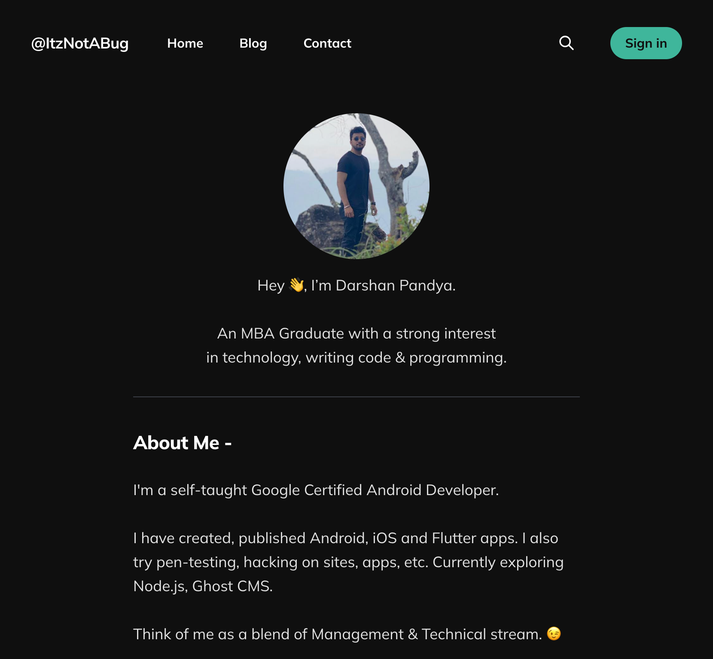
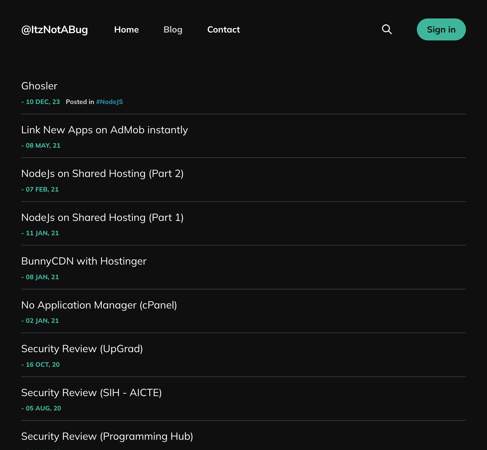
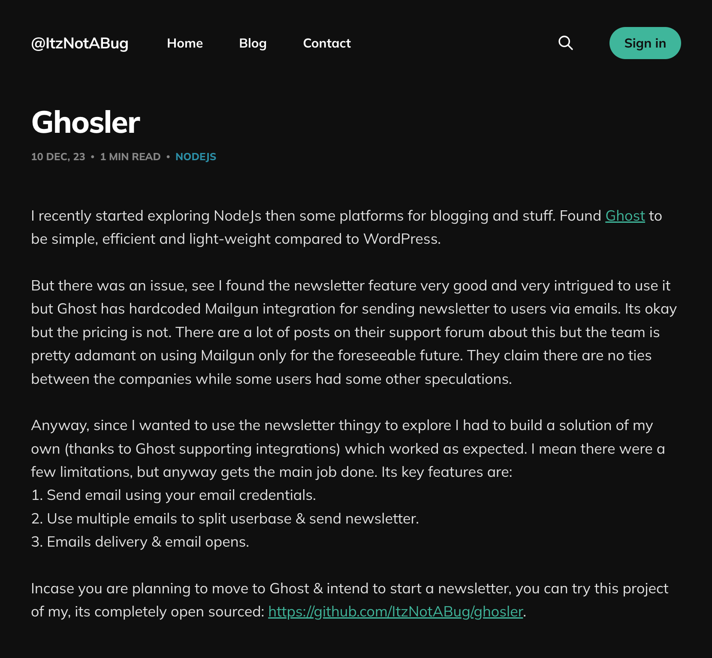
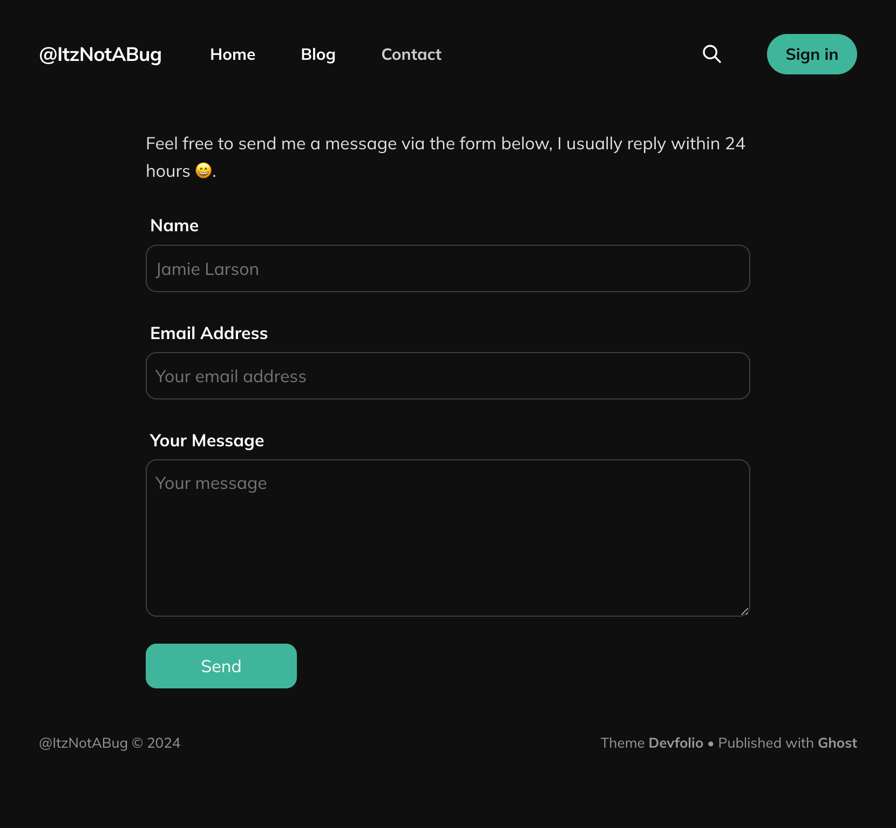
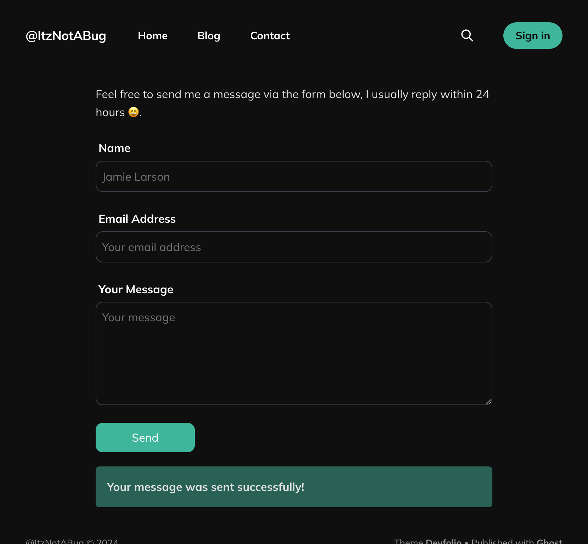
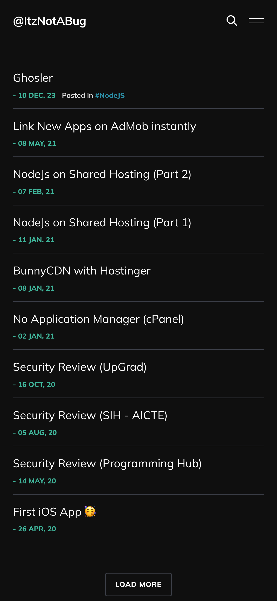
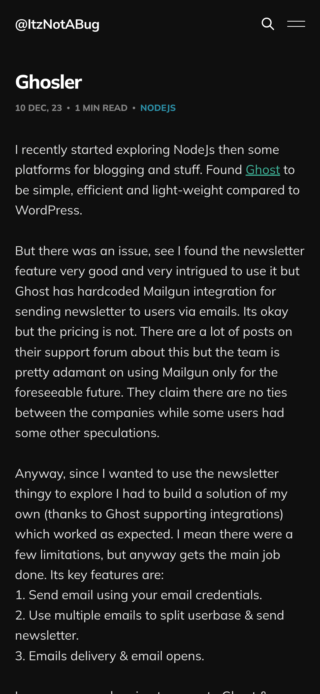
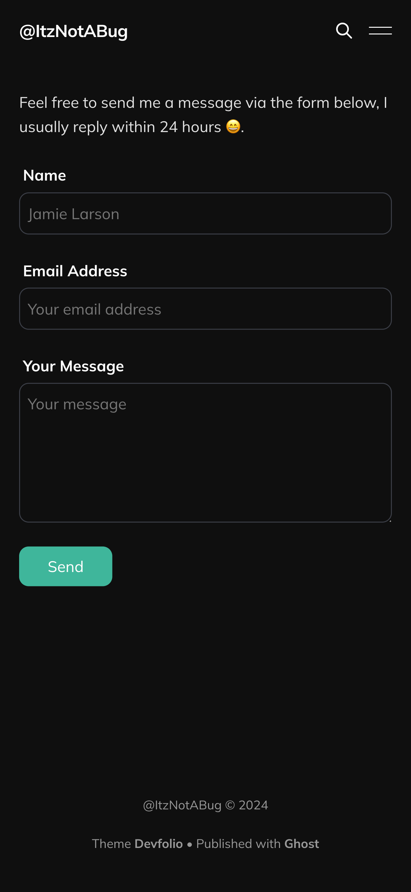
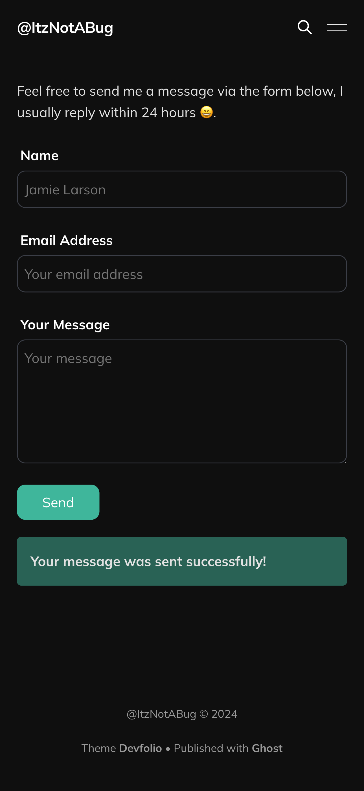

# Devfolio

DevFolio is an opinionated developer portfolio styled [Ghost](https://github.com/TryGhost/Ghost) theme that is highly
functional & customizable. Devfolio is based on the official Ghost theme - [Dawn](https://github.com/TryGhost/Dawn/).

## Features

1. Sleek Homepage
2. Separate blog page
3. Custom contact form
4. Show custom image for 404 errors
5. Manage components directly from the Theme's settings

## Screenshots

### Desktop

<table>
    <tr>
        <td></td>
        <td></td>
        <td></td>
        <td></td>
        <td></td>
    </tr>
</table>

### Mobile

<table>
    <tr>
        <td></td>
        <td></td>
        <td></td>
        <td></td>
        <td></td>
    </tr>
</table>

## Installation Guide

1. Download this theme & the `routes.yaml` from the release page.
2. Log into Ghost, and go to the `Design` settings area to upload the zip file.
3. Go to the `Labs` settings area, select the `Beta features` tab & upload the `routes.yaml` in the `Routes` section.
4. Go to `Navigation` settings area, add `Blog` (`/blog/`) & `Contact` (`/contact/`) pages to the site's primary
   navigation menu.

## Development

For development instructions and details,
see: [Ghost Dawn Development](https://github.com/TryGhost/Dawn/?tab=readme-ov-file#development).
